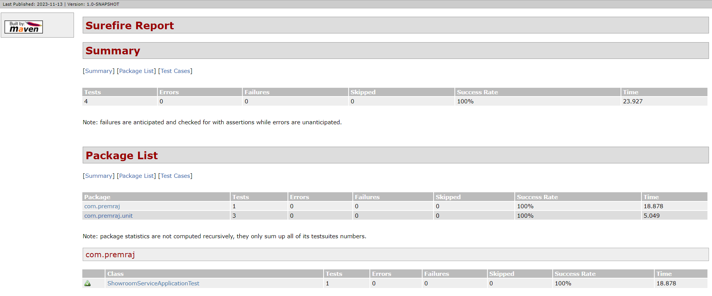
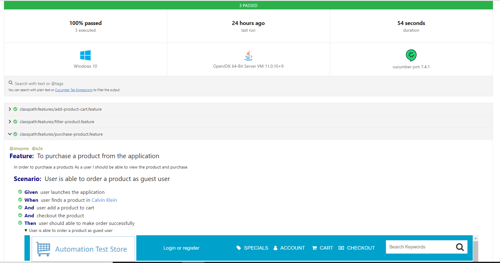
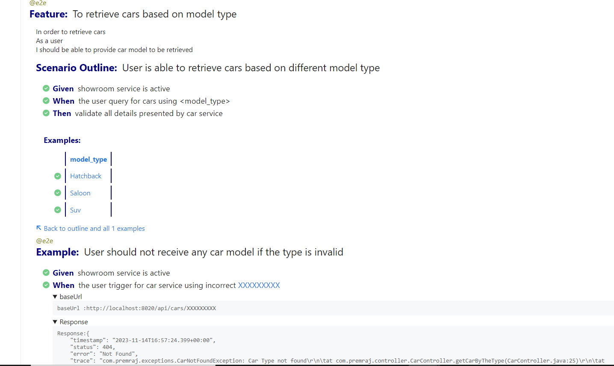

# A Multi-Module Java Project to demonstrate different levels of testing
Showroom microservices and a shopping web application under test

# Scope of Work

### Showroom Car API services developed as Backend Project
### unit, integration tests were developed for the API service.
### UI end-to-end tests developed for different web application
### Application developed and tested using SpringBoot framework 


## Stack

| Category       | Value                        |
| -------------- |------------------------------|
| Language       | Java 17                      | 
| Build Tool     | Maven                        |
| Test Tool      | Selenium WebDriver           | 
| BDD            | cucumber                     | 
| DI             | SpringBoot                   | 
| Test Framework | jUnit5 and TestNG            | 
| Reporting      | cucumber and surefire report |

## Restful API Service Development

### Developed Microservices using SpringBoot 
* Showroom Car Service suppose to return list of car details based on car type 
* Car type is passed as path variable as input for the service and 
* Data were maintained using H2 in memory database 
* Spring JPA used to interact and perform DB operation 
* microservice were developed in layers such as controller, repository, data and service layer. 
* Swagger file is implemented for the service developed.

### Run App in local:
```$xslt
mvn spring-boot:run 
```
Launch Swagger:
```$xslt
http://localhost:8020/swagger-ui/index.html
```
Retrieve Cars endpoint:
```$xslt
http://localhost:8020/api/cars/{type}
```

## unit test

### API Service
* GET showroom cars based on model type for example Suv, Saloon and Hatchback

### Objective

* To demonstrate unit testing practices on different layers
* Controller Layer
* Data layer
* Service Layer

## Integration Test

### Objective

* To demonstrate Integration testing using Rest-assured in BDD style of test
* Validate API with complete data sets
* json-schema validations
* positive and negative tests

## UI Acceptance Test

### Objective

* To demonstrate Acceptance test using Selenium WebDriver.
* Used Cucumber BDD Style of test to demonstrate business specification
* Most Critical User journey were tested

### Framework Supports

| OS        | Browsers      | Run Modes | Screenshots            |Parallelism|
| --------- | --------------|-----------|------------------------|-----------|
| Mac       | Chrome/Firefox| UI        | On every test step     | Yes       |
| Windows   | Chrome/Firefox| UI        | On every test step     | Yes       | 

### Scenarios Covered
* Filter Products
* Products added to Cart
* A complete product purchase journey

### Approach

Brief description on the important packages.

### features
* Spring SimpleThreadScope is leveraged to achieve parallel test.
* All data are model as a business entity
* Page objects and interactions are maintained ui_layer package
* Java Reflections is used for grouping and abstractions.
* All pages are built as a group of components which are reusable across applications.

### Run Test
Tests can be run on local and support for selenium grid execution.
 
Support parallel execution  -

feature tags -
@e2e, @regression

browser option -
chrome, firefox

spring profiles -
* default - application.properties

Run tests in local:
```$xslt
mvn clean test -Dbrowser=chrome -Dcucumber.filter.tags="@e2e"
```


### Reports
Cucumber reports generated after tests run:
refer to report path : target>>cucumber-report.html

### Sample screenshot of UNIT Test Report for the execution below:

### Sample screenshot of Acceptance Report for the execution below:



### Sample screenshot of API Test Report for the execution below:



### Logs
* Logs generated at target>>logs>> test-execution.log
